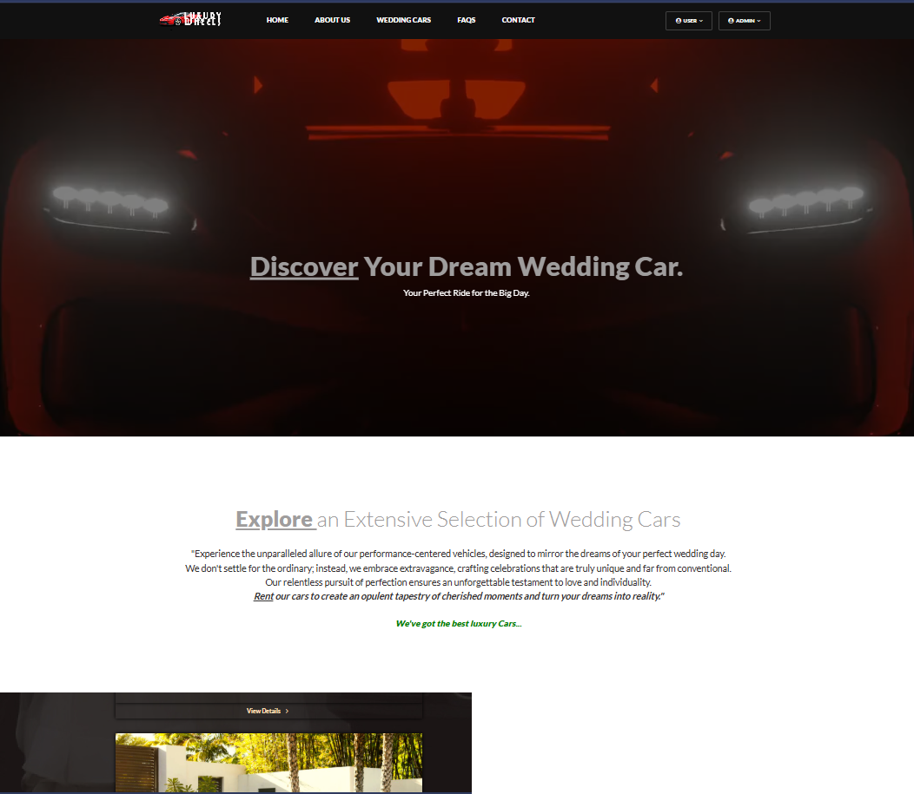
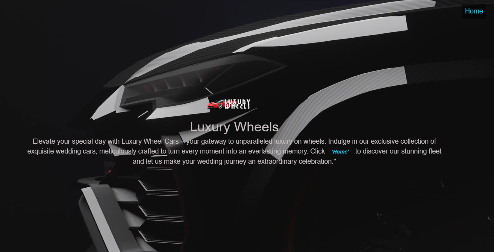
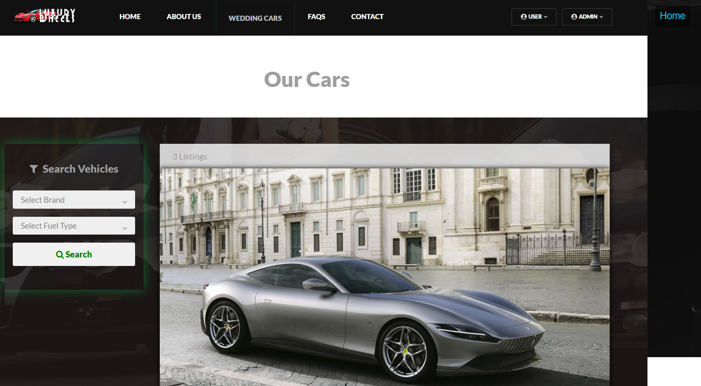
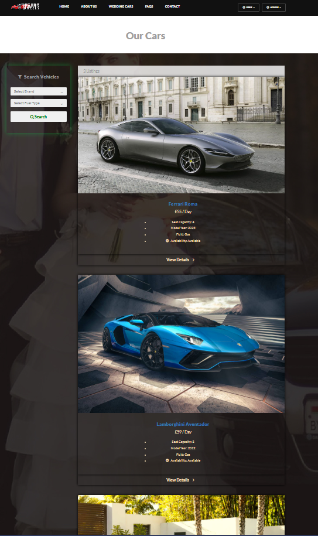
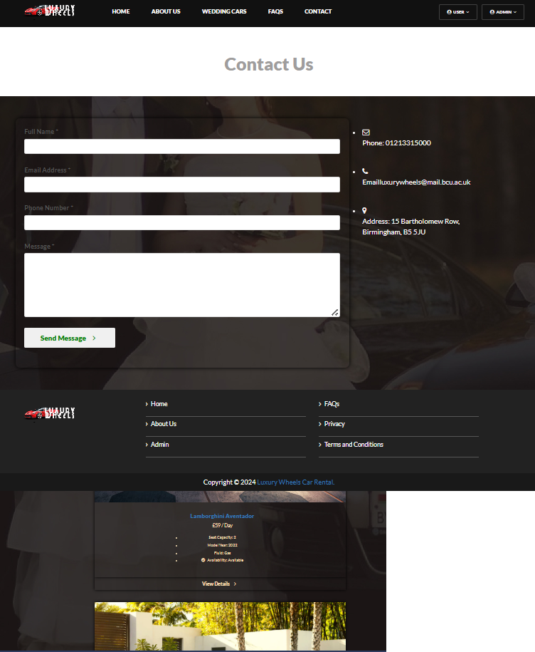
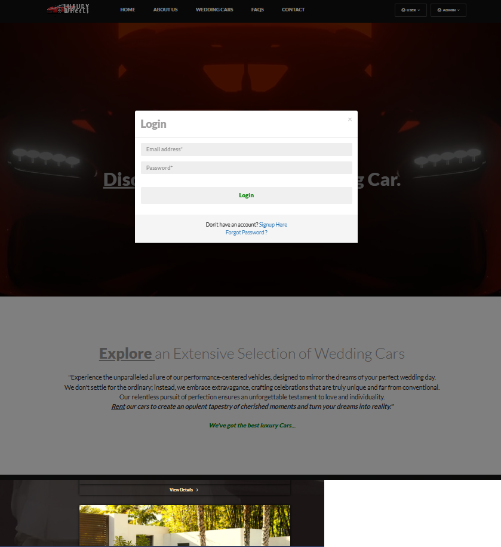

Here’s a clean, professional **README.md** that includes your LuxuryWheels images properly and makes your GitHub project look strong 👇

---

# 🚗 LuxuryWheels

A luxury car rental website built using PHP and MySQL, designed to simulate a real-world vehicle booking platform with a clean and user-focused interface.

---

## 🌐 Project Overview

LuxuryWheels allows users to browse high-end vehicles, explore rental options, and simulate a booking experience. The project focuses on combining backend functionality with a clean frontend layout.

---

## 🛠️ Features

* Car listing and display system
* Booking/reservation flow
* Database-driven content (MySQL)
* Responsive layout design
* Real-world business simulation

---

## 🧰 Tech Stack

* PHP
* MySQL
* HTML
* CSS

---

## 📸 Screenshots

### Homepage



### Car Listings




### Booking Flow




### Additional Views




---

## ⚙️ Setup Instructions

### Run Locally (XAMPP)

1. Install **XAMPP**

2. Place project folder inside:

   ```
   htdocs/
   ```

3. Start:

   * Apache
   * MySQL

4. Import database:

   * Open **phpMyAdmin**
   * Create a new database
   * Import your `.sql` file

5. Open browser:

   ```
   http://localhost/luxurywheels
   ```

---

## 📂 Folder Structure

```
LuxuryWheels/
│
├── assets/
│   └── luxurywheels/
│       ├── home.png
│       ├── lw1.png
│       ├── lw2.png
│       ├── lw3.png
│       ├── lw4.png
│       ├── lw5.png
│       ├── lw6.png
│       └── lw7.png
│
├── index.php
├── style.css
└── database.sql
```

---

## 🎯 Purpose

This project demonstrates:

* Backend integration using PHP/MySQL
* Practical website development skills
* Understanding of booking systems
* Ability to structure real-world web applications

---

## 📌 Author

**Dafe Magege**

* GitHub: [https://github.com/dnmagege](https://github.com/dnmagege)
* Portfolio: ([My Portfolio](https://dnmagege.github.io/d-newton-portfolio/))

